<<<<<<< HEAD
# DecodePlayControl 功能模块代码解析

## 目录
- [1. 功能模块总览](#1-功能模块总览)
- [2. 功能模块间联系流程图](#2-功能模块间联系流程图)
- [3. 各功能模块详细解析](#3-各功能模块详细解析)
- [4. 代码执行流程](#4-代码执行流程)

---

## 1. 功能模块总览

本应用包含 **7个核心功能模块**，每个模块由前端UI代码、业务逻辑代码和Native底层代码组成。

| 功能模块 | 功能描述 | 前端代码 | 业务逻辑代码 | Native代码 |
|---------|---------|---------|------------|-----------|
| **模块1: 应用初始化** | 加载资源、创建播放器 | Index.ets | VideoPlayViewModel.initialize() | PlayerNative.createPlayer() |
| **模块2: 视频播放** | 解码播放视频 | VideoPlayView.XComponent | VideoPlayViewModel.onVideoSelected() | Player.Start() |
| **模块3: 播放控制** | 播放/暂停/恢复 | VideoPlayView.PlayPauseButton | VideoPlayViewModel.togglePlayPause() | Player.Pause/Resume() |
| **模块4: 进度控制** | Seek定位 | VideoPlayView.TimeSlider | VideoPlayViewModel.onSliderChange() | Player.Seek() |
| **模块5: 倍速播放** | 调整播放速度 | VideoPlayView.SpeedButton | VideoPlayViewModel.onSpeedSelected() | Player.SetSpeed() |
| **模块6: 视频切换** | 切换视频资源 | VideoPlayView.VideoSelectionView | VideoPlayViewModel.onVideoSelected() | Player.Release() + Create() |
| **模块7: 全屏播放** | 横屏全屏 | VideoPlayView.FullScreenButton | VideoPlayView.fullScreenSet() | Window API |

---

## 2. 功能模块间联系流程图

### 2.1 整体功能模块关系图

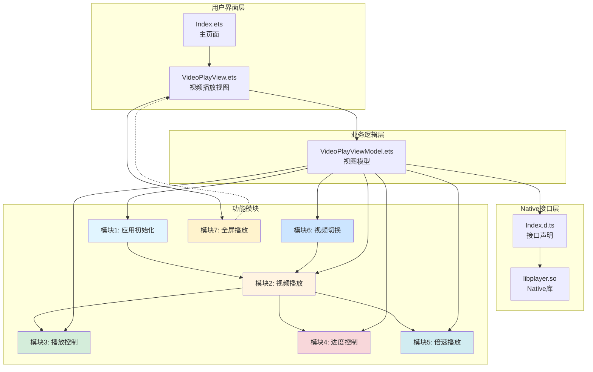

### 2.2 功能模块调用链路图

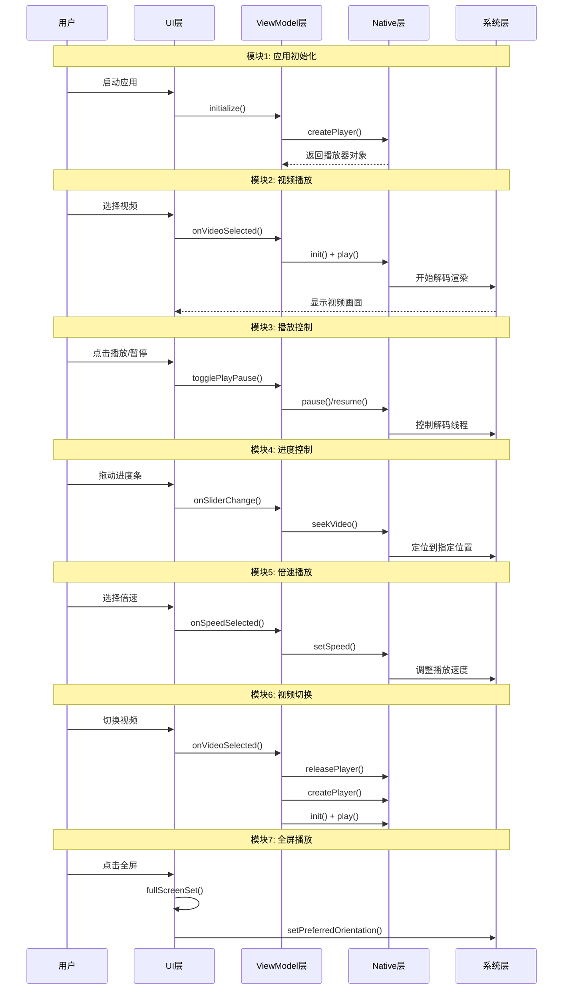

### 2.3 数据流向图

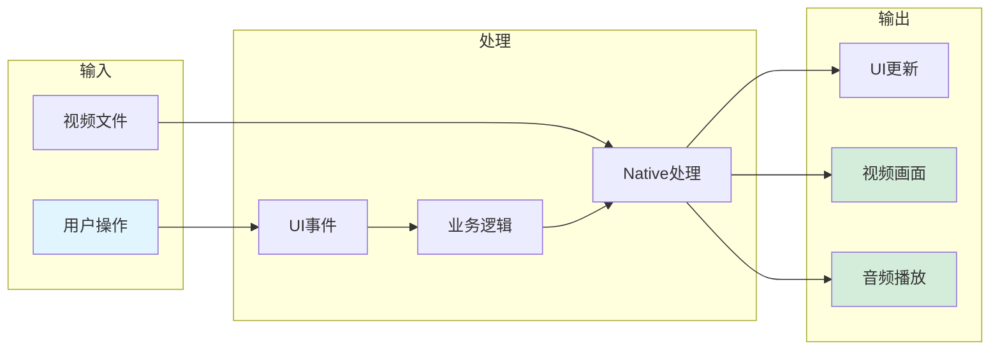

---

## 3. 各功能模块详细解析

### 模块1: 应用初始化

#### 功能描述
应用启动时加载视频资源、创建播放器实例、初始化窗口属性。

#### 代码组成

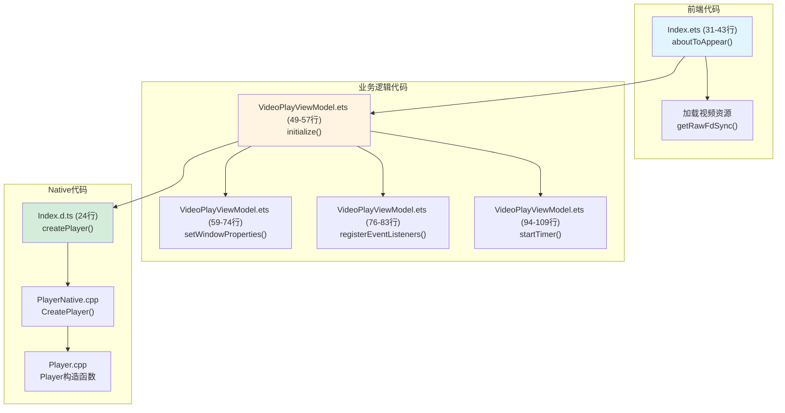

#### 关键代码片段

**前端代码 - Index.ets (31-43行)**
```typescript
aboutToAppear(): void {
  try {
    this.videoResources.length = 0;
    for (let i = 0; i< VIDEO_NAMES.length; i++) {
      let rawDes = this.getUIContext().getHostContext()?.resourceManager.getRawFdSync(VIDEO_NAMES[i]);
      if (rawDes) {
        this.videoResources.push(rawDes);
      }
    }
  } catch (error) {
    hilog.error(0x0000, TAG, `aboutToAppear catch error, code: ${error.code}, message: ${error.message}`);
  }
}
```

**业务逻辑代码 - VideoPlayViewModel.ets (49-57行)**
```typescript
async initialize(): Promise<void> {
  try {
    await this.setWindowProperties();
    this.registerEventListeners();
    this.startTimer();
  } catch (error) {
    hilog.error(DOMAIN, TAG, `initialize catch error, code: ${error.code}, message: ${error.message}`);
  }
}
```

**Native接口 - Index.d.ts (24行)**
```typescript
export const createPlayer: () => bigint;
```

#### 执行流程
1. Index.ets 页面加载时调用 `aboutToAppear()`
2. 加载3个视频文件资源到 `videoResources` 数组
3. VideoPlayView 初始化时调用 `viewModel.initialize()`
4. 设置窗口属性（状态栏颜色、保持屏幕常亮）
5. 注册前后台事件监听
6. 启动定时器用于更新播放进度

---

### 模块2: 视频播放

#### 功能描述
选择视频后，创建解码器、解封装器，开始解码播放视频。

#### 代码组成

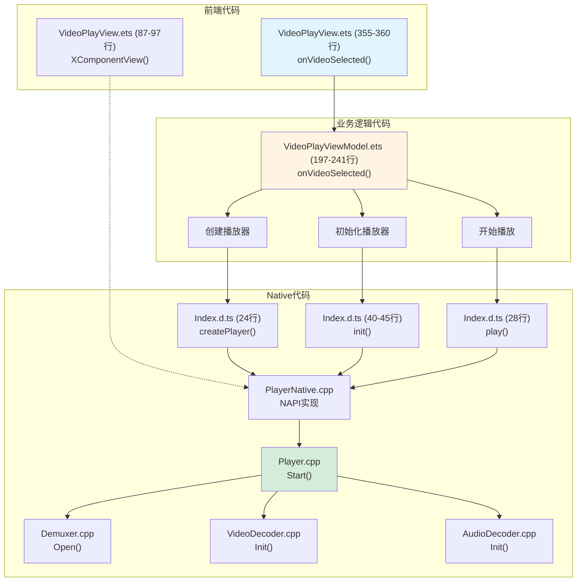

#### 关键代码片段

**前端代码 - VideoPlayView.ets (355-360行)**
```typescript
private async onVideoSelected(index: number, rawDes: resourceManager.RawFileDescriptor): Promise<void> {
  const newState = await this.viewModel.onVideoSelected(index, rawDes);
  if (newState !== null) {
    this.viewModel.playState = newState;
  }
}
```

**业务逻辑代码 - VideoPlayViewModel.ets (197-241行)**
```typescript
async onVideoSelected(index: number, rawDes: resourceManager.RawFileDescriptor): Promise<PlayerState | null> {
  if (this.chooseNumber === index) {
    return null;
  }
  
  this.isSwitchEnable = false;
  this.durationTime = 0;
  this.chooseNumber = index;
  this.isUse = false;
  this.chooseSpeed = Const.VIDEO_DEFAULT_SPEED;
  this.speedText = $r('app.string.Default_speed_text');
  
  if (!rawDes) {
    hilog.error(DOMAIN, TAG, 'player inputFile is null');
    this.isSwitchEnable = true;
    return null;
  }
  
  try {
    await this.releasePlayer();
    this.nativePlayerObj = player.createPlayer();
    const data = await player.init(this.nativePlayerObj, rawDes.fd, rawDes.offset, rawDes.length);
    this.isSeek = false;
    
    if (data.code === 0) {
      this.durationTime = data.durationTime / Const.TIME_RATIO;
      this.isUse = true;
      this.isSwitchEnable = true;
      
      player.play(this.nativePlayerObj);
      return PlayerState.PLAYING;
    } else {
      hilog.error(DOMAIN, TAG, 'player init failed, err code is ' + data.code);
      await this.releasePlayer();
    }
    
    this.isSwitchEnable = true;
  } catch (error) {
    hilog.error(DOMAIN, TAG, `Switch video failed: ${error.code}, message: ${error.message}`);
    await this.releasePlayer();
    this.isSwitchEnable = true;
  }
  
  return null;
}
```

**Native接口 - Index.d.ts**
```typescript
export const createPlayer: () => bigint;

export const init: (
  objAddr: bigint,
  inputFileFd: number,
  inputFileOffset: number,
  inputFileSize: number
) => Promise<Response>;

export const play: (objAddr: bigint) => void;
```

#### 执行流程
1. 用户点击视频列表项，触发 `onVideoSelected()`
2. 调用 `releasePlayer()` 释放旧播放器
3. 调用 `createPlayer()` 创建新播放器实例
4. 调用 `init()` 初始化播放器（传入文件描述符）
5. 调用 `play()` 开始播放
6. Native层创建解封装器、视频解码器、音频解码器
7. 启动解码线程，开始解码渲染

---

### 模块3: 播放控制

#### 功能描述
控制视频的播放、暂停、恢复状态。

#### 代码组成

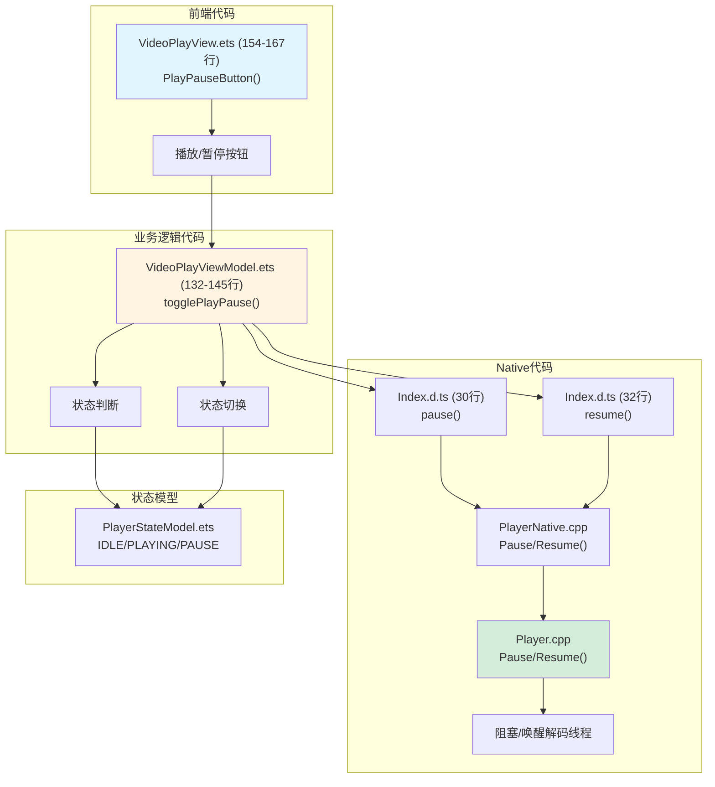

#### 关键代码片段

**前端代码 - VideoPlayView.ets (154-167行)**
```typescript
@Builder
PlayPauseButton() {
  Row() {
    Image(this.viewModel.playState === PlayerState.PLAYING ?
      $r('app.media.ic_public_pause') : $r('app.media.ic_public_play'))
      .width('25vp')
      .height('25vp')
      .onClick(() => {
        this.viewModel.playState = this.viewModel.togglePlayPause(this.viewModel.playState);
      })
  }
  .width('25vp')
  .height('100%')
  .justifyContent(FlexAlign.Center)
}
```

**业务逻辑代码 - VideoPlayViewModel.ets (132-145行)**
```typescript
togglePlayPause(playState: PlayerState): PlayerState {
  if (this.nativePlayerObj === BigInt(0)) {
    return playState;
  }
  
  if (playState === PlayerState.PLAYING) {
    player.pause(this.nativePlayerObj);
    return PlayerState.PAUSE;
  } else if (playState === PlayerState.PAUSE) {
    player.resume(this.nativePlayerObj);
    return PlayerState.PLAYING;
  }
  return playState;
}
```

**Native接口 - Index.d.ts**
```typescript
export const pause: (objAddr: bigint) => void;
export const resume: (objAddr: bigint) => void;
```

#### 执行流程
1. 用户点击播放/暂停按钮
2. 根据当前状态判断执行操作
3. 如果正在播放，调用 `pause()` 暂停
4. 如果已暂停，调用 `resume()` 恢复
5. Native层阻塞或唤醒解码线程
6. 更新UI状态显示

---

### 模块4: 进度控制

#### 功能描述
通过进度条控制视频播放位置，实现Seek定位功能。

#### 代码组成

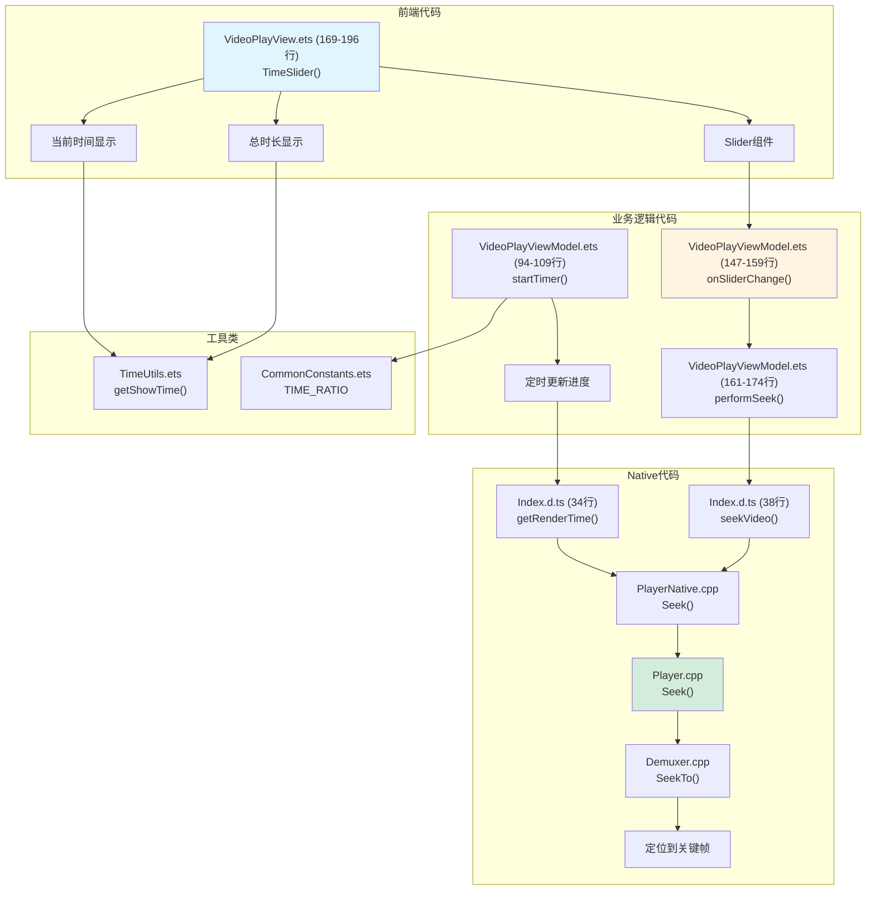

#### 关键代码片段

**前端代码 - VideoPlayView.ets (169-196行)**
```typescript
@Builder
TimeSlider() {
  Row() {
    Text(getShowTime(this.viewModel.currentTime))
      .fontColor(Color.White)
      .fontSize('12fp')

    Slider({
      value: this.viewModel.currentTime,
      min: 0,
      max: this.viewModel.durationTime
    })
      .width(this.isFullScreen ? '90%' : '70%')
      .selectedColor('#F67609')
      .trackColor('#464642')
      .enabled(!this.viewModel.isSeek)
      .onChange((value: number, mode: SliderChangeMode) => {
        this.viewModel.onSliderChange(value, mode);
      })

    Text(getShowTime(this.viewModel.durationTime))
      .fontColor(Color.White)
      .fontSize('12fp')
  }
  .width(this.isFullScreen ? '90%' : '70%')
  .height('100%')
  .justifyContent(FlexAlign.Center)
}
```

**业务逻辑代码 - VideoPlayViewModel.ets (147-174行)**
```typescript
onSliderChange(value: number, mode: SliderChangeMode): void {
  this.currentTime = value;
  
  if (this.durationTime > 0) {
    if (mode === SliderChangeMode.Begin) {
      this.isSeek = true;
    }
    
    if (mode === SliderChangeMode.End) {
      this.performSeek(value);
    }
  }
}

async performSeek(value: number): Promise<void> {
  if (this.nativePlayerObj === BigInt(0)) {
    return;
  }
  
  try {
    await player.seekVideo(this.nativePlayerObj, value);
    setTimeout(() => {
      this.isSeek = false;
    }, Const.RELOAD_TIME);
  } catch (error) {
    hilog.error(DOMAIN, TAG, `Seek failed: ${error.code}, message: ${error.message}`);
  }
}
```

**Native接口 - Index.d.ts**
```typescript
export const getRenderTime: (objAddr: bigint) => number;
export const seekVideo: (objAddr: bigint, desTime: number) => Promise<void>;
```

#### 执行流程
1. 定时器每秒调用 `getRenderTime()` 获取当前播放时间
2. 更新进度条显示
3. 用户拖动进度条时，触发 `onSliderChange()`
4. 开始拖动时设置 `isSeek = true` 停止更新
5. 结束拖动时调用 `performSeek()` 执行Seek
6. Native层定位到目标位置的关键帧
7. 清空缓冲区，重新填充数据
8. 恢复播放，设置 `isSeek = false`

---

### 模块5: 倍速播放

#### 功能描述
支持1.0X、2.0X、3.0X倍速播放，调整音频渲染速度。

#### 代码组成

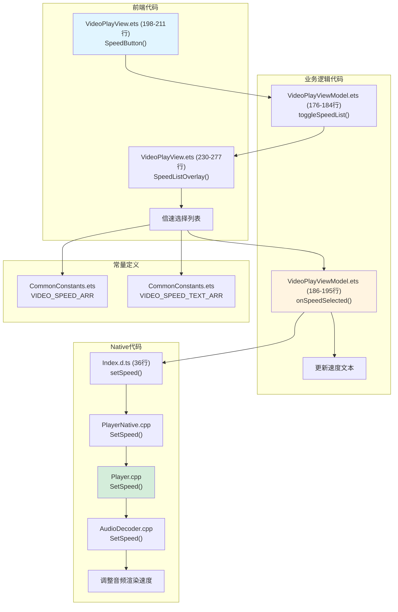

#### 关键代码片段

**前端代码 - VideoPlayView.ets (198-211行, 230-277行)**
```typescript
@Builder
SpeedButton() {
  Row() {
    Text(this.viewModel.speedText)
      .fontColor(Color.White)
      .fontSize('14fp')
  }
  .width(this.isFullScreen ? '5%' : '14%')
  .height('100%')
  .justifyContent(FlexAlign.Center)
  .onClick(() => {
    this.viewModel.toggleSpeedList();
  })
}

@Builder
SpeedListOverlay() {
  Row() {
    Column() {
      List({ space: 0, initialIndex: 2 }) {
        ForEach(Const.VIDEO_SPEED_ARR, (item: number, index: number) => {
          ListItem() {
            Column() {
              Text(Const.VIDEO_SPEED_TEXT_ARR[index])
                .fontSize('16fp')
                .fontColor(this.viewModel.chooseSpeed === item ? '#F67609' : '#FFFFFF')
            }
            .width('100%')
            .height('50vp')
            .justifyContent(FlexAlign.Center)
            .alignItems(HorizontalAlign.Center)
            .onClick(() => {
              this.viewModel.onSpeedSelected(item, index);
            })
          }
        }, (item: number, index: number) => {
          return 'item: ' + item.toString() + 'index: ' + index.toString();
        })
      }
      .width('100%')
      .height('100%')
      .stackFromEnd(true)
    }
    .width(this.isFullScreen ? '180vp' : '120vp')
    .height('100%')
    .padding({ top: '16vp', bottom: '36vp' })
    .justifyContent(FlexAlign.End)
    .backgroundColor('#08ffffff')
  }
  .width('100%')
  .height('100%')
  .justifyContent(FlexAlign.End)
  .visibility(this.viewModel.isSpeedListVisible ? Visibility.Visible : Visibility.Hidden)
  .onClick(() => {
    this.viewModel.hideSpeedList();
  })
}
```

**业务逻辑代码 - VideoPlayViewModel.ets (176-195行)**
```typescript
toggleSpeedList(): void {
  this.isSpeedListVisible = true;
}

hideSpeedList(): void {
  if (this.isSpeedListVisible) {
    this.isSpeedListVisible = false;
  }
}

onSpeedSelected(speed: number, index: number): void {
  if (this.chooseSpeed !== speed) {
    this.chooseSpeed = speed;
    if (this.nativePlayerObj !== BigInt(0)) {
      player.setSpeed(this.nativePlayerObj, speed);
    }
    this.speedText = Const.VIDEO_SPEED_TEXT_ARR[index];
    this.isSpeedListVisible = false;
  }
}
```

**Native接口 - Index.d.ts (36行)**
```typescript
export const setSpeed: (objAddr: bigint, speed: number) => void;
```

#### 执行流程
1. 用户点击倍速按钮，显示倍速选择列表
2. 用户选择倍速值（1.0X/2.0X/3.0X）
3. 调用 `onSpeedSelected()` 处理选择
4. 调用 `setSpeed()` 设置播放速度
5. Native层调整音频渲染速度
6. 更新音画同步参数
7. 更新UI显示当前倍速

---

### 模块6: 视频切换

#### 功能描述
切换播放不同的视频资源，释放旧播放器，创建新播放器。

#### 代码组成

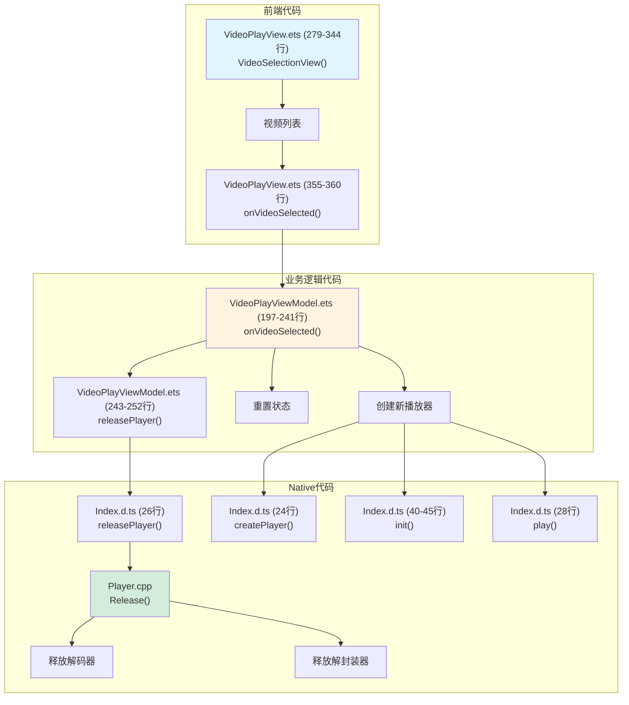

#### 关键代码片段

**前端代码 - VideoPlayView.ets (279-344行)**
```typescript
@Builder
VideoSelectionView() {
  Column() {
    Row() {
      Text($r('app.string.Video_name'))
        .fontSize('24fp')
        .fontWeight(FontWeight.Bold)
        .fontColor(Color.White)
    }
    .width('100%')
    .height('25%')
    .justifyContent(FlexAlign.Start)
    .padding({ left: '20vp', right: '20vp' })

    Row() {
      Text($r('app.string.Episodes'))
        .fontSize('16fp')
        .fontWeight(FontWeight.Regular)
        .fontColor(Color.White)
    }
    .width('100%')
    .height('20%')
    .padding({ left: '20vp', right: '20vp' })

    Row() {
      List({ space: '16vp', initialIndex: 0 }) {
        ForEach(this.videoSources, (item: resourceManager.RawFileDescriptor, index: number) => {
          ListItem() {
            Column() {
              Text((index + 1).toString())
                .fontSize('20fp')
                .fontColor(this.viewModel.chooseNumber === index && this.viewModel.isUse ? '#F67609' : '#FFFFFF')
            }
            .width(40)
            .height(40)
            .backgroundColor('#3B3A37')
            .borderRadius($r('sys.float.corner_radius_level5'))
            .justifyContent(FlexAlign.Center)
            .alignItems(HorizontalAlign.Center)
            .borderColor(this.viewModel.chooseNumber === index && this.viewModel.isUse ? '#F67609' : '#3B3A37')
            .borderWidth(1)
            .onClick(() => {
              this.onVideoSelected(index, item);
            })
          }
        }, (item: resourceManager.RawFileDescriptor, index: number) => {
          return 'item: ' + item.toString() + 'index: ' + index.toString();
        })
      }
      .width('100%')
      .height('100%')
      .listDirection(Axis.Horizontal)
      .enabled(this.viewModel.isSwitchEnable)
    }
    .width('100%')
    .height('30%')
    .padding({ left: '20vp', right: '20vp' })
  }
  .width('100%')
  .height('35%')
  .linearGradient({
    direction: GradientDirection.Bottom,
    colors: [[0x1b1a1c, 0], [0x000000, 0.5]]
  })
  .visibility(this.isFullScreen ? Visibility.Hidden : Visibility.Visible)
}
```

**业务逻辑代码 - VideoPlayViewModel.ets (197-252行)**
```typescript
async onVideoSelected(index: number, rawDes: resourceManager.RawFileDescriptor): Promise<PlayerState | null> {
  if (this.chooseNumber === index) {
    return null;
  }
  
  this.isSwitchEnable = false;
  this.durationTime = 0;
  this.chooseNumber = index;
  this.isUse = false;
  this.chooseSpeed = Const.VIDEO_DEFAULT_SPEED;
  this.speedText = $r('app.string.Default_speed_text');
  
  if (!rawDes) {
    hilog.error(DOMAIN, TAG, 'player inputFile is null');
    this.isSwitchEnable = true;
    return null;
  }
  
  try {
    await this.releasePlayer();
    this.nativePlayerObj = player.createPlayer();
    const data = await player.init(this.nativePlayerObj, rawDes.fd, rawDes.offset, rawDes.length);
    this.isSeek = false;
    
    if (data.code === 0) {
      this.durationTime = data.durationTime / Const.TIME_RATIO;
      this.isUse = true;
      this.isSwitchEnable = true;
      
      player.play(this.nativePlayerObj);
      return PlayerState.PLAYING;
    } else {
      hilog.error(DOMAIN, TAG, 'player init failed, err code is ' + data.code);
      await this.releasePlayer();
    }
    
    this.isSwitchEnable = true;
  } catch (error) {
    hilog.error(DOMAIN, TAG, `Switch video failed: ${error.code}, message: ${error.message}`);
    await this.releasePlayer();
    this.isSwitchEnable = true;
  }
  
  return null;
}

async releasePlayer(): Promise<void> {
  if (this.nativePlayerObj !== BigInt(0)) {
    try {
      player.releasePlayer(this.nativePlayerObj);
      this.nativePlayerObj = BigInt(0);
    } catch (error) {
      hilog.error(DOMAIN, TAG, `Release player failed: ${error.code}, message: ${error.message}`);
    }
  }
}
```

**Native接口 - Index.d.ts**
```typescript
export const releasePlayer: (objAddr: bigint) => void;
export const createPlayer: () => bigint;
export const init: (
  objAddr: bigint,
  inputFileFd: number,
  inputFileOffset: number,
  inputFileSize: number
) => Promise<Response>;
export const play: (objAddr: bigint) => void;
```

#### 执行流程
1. 用户点击视频列表中的视频项
2. 判断是否为当前播放视频，是则不处理
3. 禁用切换按钮，重置状态
4. 调用 `releasePlayer()` 释放旧播放器
5. Native层释放解码器、解封装器等资源
6. 调用 `createPlayer()` 创建新播放器
7. 调用 `init()` 初始化新视频
8. 调用 `play()` 开始播放新视频
9. 启用切换按钮

---

### 模块7: 全屏播放

#### 功能描述
切换横屏全屏播放模式，调整窗口方向和布局。

#### 代码组成

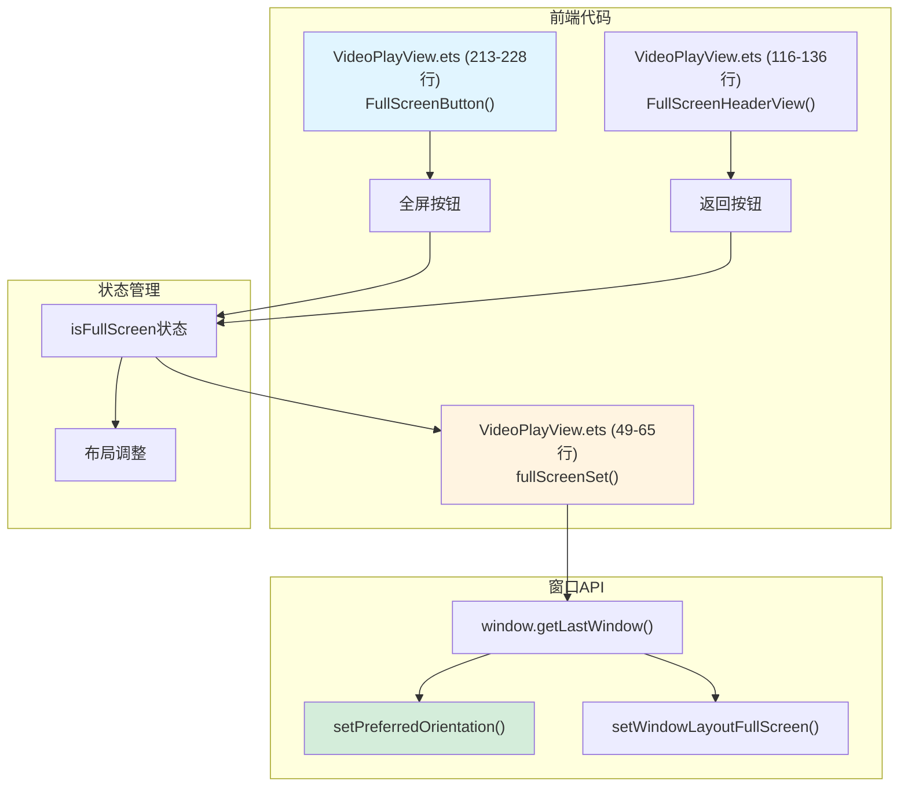

#### 关键代码片段

**前端代码 - VideoPlayView.ets (213-228行, 49-65行)**
```typescript
@Builder
FullScreenButton() {
  if (!this.isFullScreen) {
    Row() {
      Image($r('app.media.ic_public_enlarge'))
        .width('25vp')
        .height('25vp')
    }
    .width('8%')
    .height('100%')
    .justifyContent(FlexAlign.Center)
    .onClick(() => {
      this.isFullScreen = !this.isFullScreen;
    })
  }
}

fullScreenSet() {
  // Change window orientation and layout when setting full screen.
  window.getLastWindow(this.getUIContext().getHostContext()).then((topWindow) => {
    topWindow.setPreferredOrientation(this.isFullScreen ?
      window.Orientation.AUTO_ROTATION_LANDSCAPE : window.Orientation.PORTRAIT).catch((error: BusinessError) => {
      hilog.error(DOMAIN, TAG, `Failed to setPreferredOrientation. Cause: ${error.code}, message: ${error.message}`);
    });
    topWindow.setWindowLayoutFullScreen(this.isFullScreen ? true : false).catch((error: BusinessError) => {
      hilog.error(DOMAIN, TAG,
        `Failed to setWindowLayoutFullScreen. Cause: ${error.code}, message: ${error.message}`);
    });
  }).catch((error: BusinessError) => {
    hilog.error(DOMAIN, TAG, `Failed to getLastWindow. Cause: ${error.code}, message: ${error.message}`);
  });
}
```

**前端代码 - VideoPlayView.ets (116-136行)**
```typescript
@Builder
FullScreenHeaderView() {
  Row() {
    Image($r('app.media.back'))
      .width('40vp')
      .height('40vp')
      .onClick(() => {
        this.isFullScreen = false;
      })

    Text($r('app.string.Video_name'))
      .fontColor(Color.White)
      .fontSize('20fp')
      .fontWeight(FontWeight.Medium)
      .margin({ left: '12vp' })
  }
  .width('100%')
  .height('24%')
  .justifyContent(FlexAlign.Start)
  .padding({ left: '36vp' })
  .visibility(this.isFullScreen ? Visibility.Visible : Visibility.Hidden)
}
```

#### 执行流程
1. 用户点击全屏按钮
2. 切换 `isFullScreen` 状态
3. 触发 `fullScreenSet()` 方法
4. 获取窗口实例
5. 设置窗口方向（横屏/竖屏）
6. 设置全屏布局
7. UI根据 `isFullScreen` 状态调整布局
8. 全屏时显示返回按钮，隐藏视频列表
9. 点击返回按钮退出全屏

---

## 4. 代码执行流程

### 4.1 完整应用启动流程

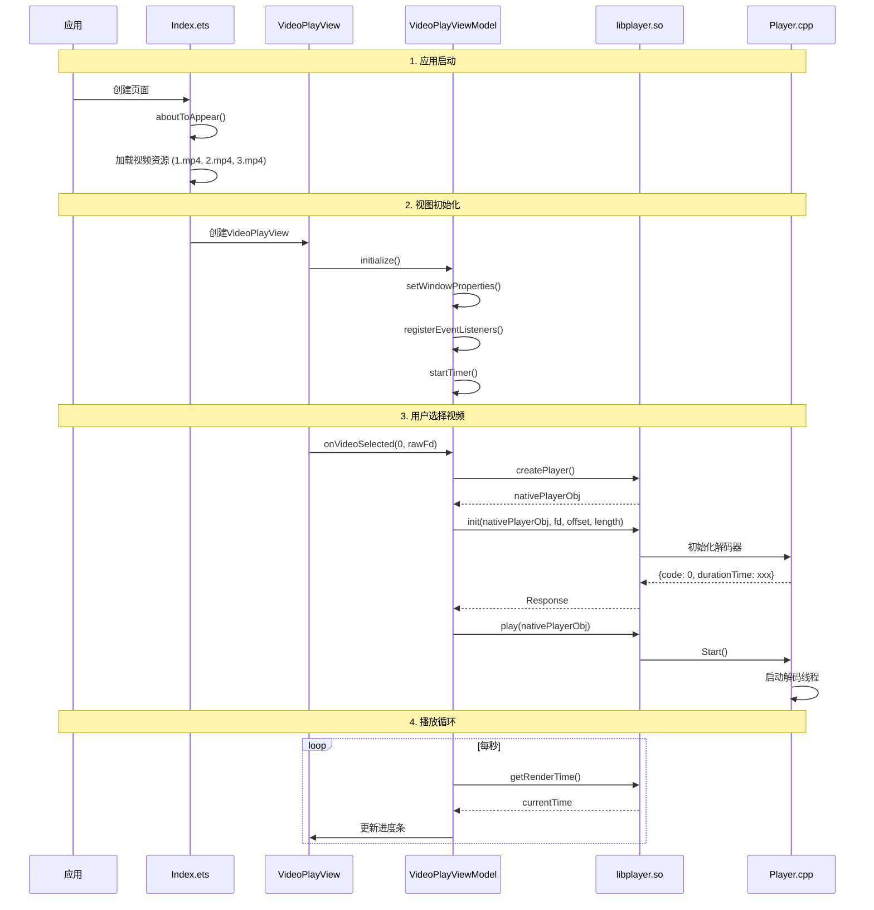

### 4.2 用户交互流程

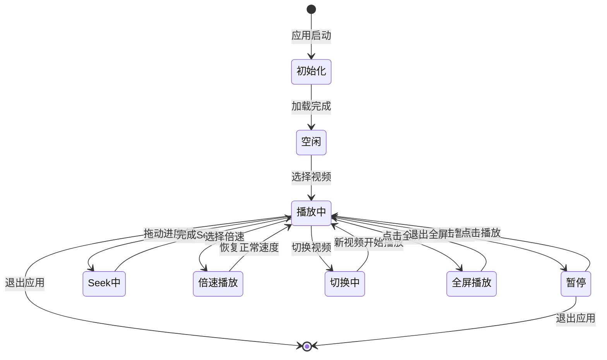

### 4.3 Native层解码流程

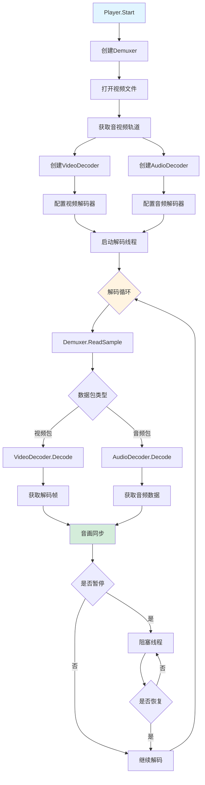

---

## 5. 总结

### 5.1 代码组织特点

1. **分层清晰**: 前端UI层、业务逻辑层、Native层职责明确
2. **MVVM架构**: View和ViewModel分离，便于维护
3. **NAPI桥接**: ArkTS与C++高效交互
4. **模块化设计**: 每个功能独立，代码复用性高

### 5.2 功能模块关系

- **模块1（初始化）** 是所有功能的基础
- **模块2（视频播放）** 是核心功能，其他模块依赖它
- **模块3-5（播放控制、进度、倍速）** 是播放功能的扩展
- **模块6（视频切换）** 复用了模块1和模块2的代码
- **模块7（全屏）** 是独立的UI功能

### 5.3 关键技术点

- **XComponent Surface渲染**: 高效的视频渲染方式
- **多线程解码**: input/output线程并行处理
- **音画同步**: 基于时间戳的精确同步
- **资源管理**: 完善的创建和释放机制